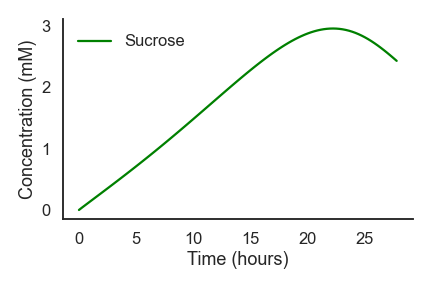
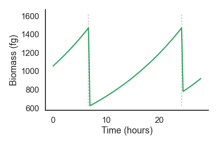
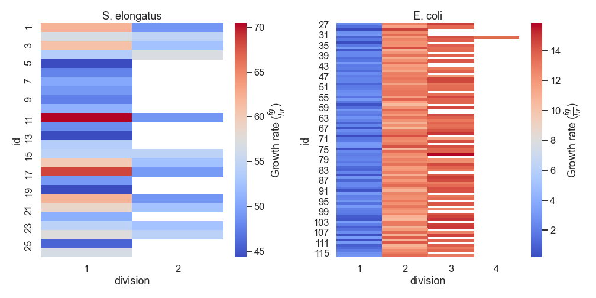
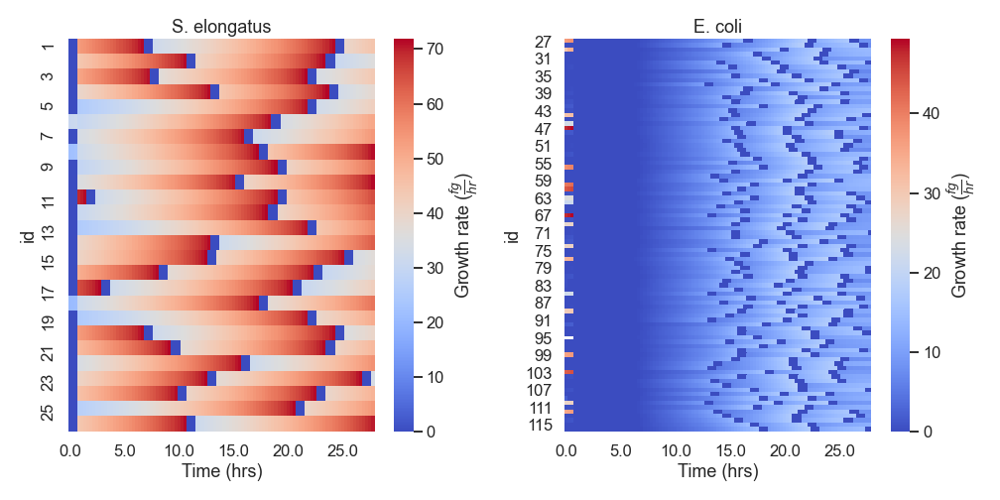
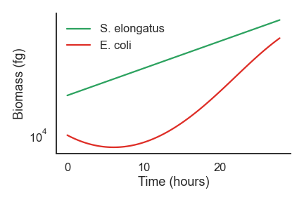
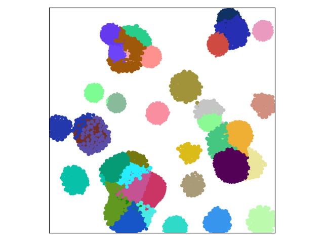
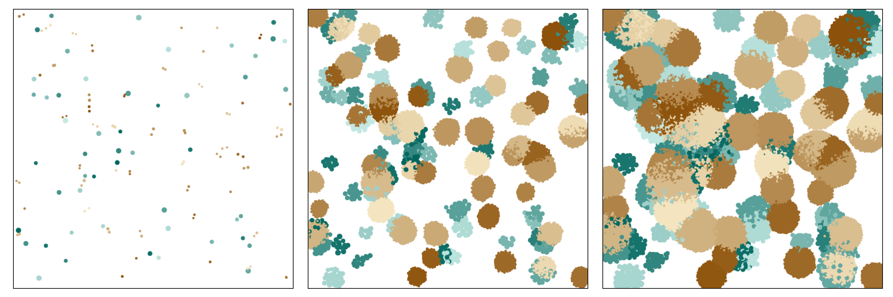

NUFEB Simulation Analysis
=========================

Get Simulation Data
-------------------
.. autoclass:: nufeb_tools.utils.get_data
    :members:
    :undoc-members:
    :member-order: bysource
    :show-inheritance:

Plotting
--------

Average Nutrient Concentration
^^^^^^^^^^^^^^^^^^^^^^^^^^^^^^
.. autofunction:: nufeb_tools.plot.average_nutrients

   
.. code-block:: python
    
    from nufeb_tools import utils, plot
    import matplotlib.pyplot as plt
    import seaborn as sns
    x = utils.get_data(directory = None,test=True)
    f, ax = plt.subplots()
    sns.set_context('talk')
    sns.set_style('white')
    plot.average_nutrients(x.avg_con,'Sucrose',color='Green',legend=True)

Single Cell Growth
^^^^^^^^^^^^^^^^^^
.. autofunction:: nufeb_tools.plot.biomass_time

.. code-block:: python

    from nufeb_tools import utils, plot
    import matplotlib.pyplot as plt
    import seaborn as sns
    f, ax = plt.subplots()
    sns.set_context('talk')
    sns.set_style('white')
    x = utils.get_data(directory = None,test=True)
    plot.biomass_time(x.positions)
    f.tight_layout()

Single Cell Growth Rate
^^^^^^^^^^^^^^^^^^^^^^^
.. autofunction:: nufeb_tools.plot.growth_rate_div

.. autofunction:: nufeb_tools.plot.growth_rate_time

.. code-block:: python

    from nufeb_tools import utils, plot
    import matplotlib.pyplot as plt
    x = utils.get_data(directory = None,test=True)
    plot.growth_rate_div(x.positions)

.. code-block:: python

    from nufeb_tools import utils, plot
    import matplotlib.pyplot as plt
    x = utils.get_data(directory = None,test=True)
    plot.growth_rate_time(x.positions)

Overall Cell Growth
^^^^^^^^^^^^^^^^^^^
.. autofunction:: nufeb_tools.plot.overall_growth

.. code-block:: python

    from nufeb_tools import utils, plot
    import matplotlib.pyplot as plt
    import seaborn as sns
    sns.set_style('white')
    sns.set_context('talk')
    f, ax = plt.subplots()
    x = utils.get_data(directory = None,test=True)
    plot.overall_growth(x.biomass,ax=ax)
    f.tight_layout()

Whole Colony Plotting
^^^^^^^^^^^^^^^^^^^^^
.. autofunction:: nufeb_tools.plot.colony

.. code-block:: python

    from nufeb_tools import utils, plot
    import matplotlib.pyplot as plt
    x = utils.get_data(directory= r'D:\runs\Run_21_18_56_1_2021-07-12')
    f,ax = plt.subplots()
    plot.colony(x,35000,colors,ax=ax)
    plt.show()

Plot colonies over time by species:

.. code-block:: python

    from nufeb_tools import utils, plot
    import matplotlib.pyplot as plt
    x = utils.get_data(directory= r'D:\runs\Run_21_18_56_1_2021-07-12')
    f, axes = plt.subplots(ncols=3,figsize=(15,5))
    for ax, time in zip(axes,[100,20000,35000]):
        plot.plot_colony(x,time,by='Species',ax=ax)
    plt.show()

